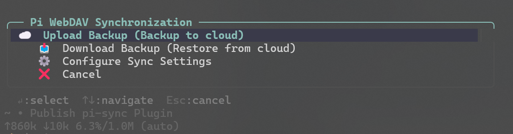

# pi-sync

[English](./README.md) | **简体中文**

[](https://github.com/earendil-works/pi-coding-agent)
[](./LICENSE)
[](https://github.com/BevalZ/pi-sync/releases)

面向 [Pi](https://github.com/earendil-works/pi-coding-agent) 的 WebDAV 配置同步工具 —— 跨机器备份与恢复 **models**、**settings**、**skills**、**extensions**。

在 Pi 里输入 `/sync`，从菜单选择操作。一台机器上传，另一台下载并恢复。

<p align="center">
  
</p>

<p align="center"><sub><b>Pi WebDAV Synchronization</b> —— 输入 <code>/sync</code> 后的交互菜单</sub></p>

## 为什么需要它

如果你在多台 PC / WSL / 服务器上使用 Pi，手工重装 models、skills、extensions 很痛苦。`pi-sync` 会把 agent 主目录打包成带时间戳的 zip，上传到任意 WebDAV 目录，并在恢复时保留本地安全备份。

## 安装

需要 [Pi coding agent](https://github.com/earendil-works/pi-coding-agent)，以及可用的 WebDAV（TeraCLOUD、坚果云、Nextcloud、ownCloud、自建等）。

```bash
pi install git:github.com/BevalZ/pi-sync@v1.3.2
```

然后重启 Pi，或执行 `/reload`。

## 用法

在 Pi 中输入 **`/sync`**。没有命令行子命令 —— 全部通过交互菜单完成：

| 菜单项 | 作用 |
|--------|------|
| ☁️ **Upload Backup (Backup to cloud)** | 打包当前配置并上传到 WebDAV |
| 📥 **Download Backup (Restore from cloud)** | 列出云端备份，下载并在确认后恢复 |
| ⚙️ **Configure Sync Settings** | 配置 WebDAV 地址 / 用户 / 密码，以及同步范围 |
| ❌ **Cancel** | 退出菜单 |

TUI 提示：`↵` 选择 · `↑↓` 导航 · `Esc` 取消。

### 首次配置

```bash
# 1. 安装
pi install git:github.com/BevalZ/pi-sync@v1.3.2

# 2. 打开菜单（若尚未配置 WebDAV，会先进入设置向导）
/sync

# 3. 如需修改：Configure Sync Settings
#    填写 URL / 用户名 / 密码
#    建议：密码填 $PI_WEBDAV_PASS，并在 shell 中 export 该环境变量

# 4. 主力机 → Upload Backup (Backup to cloud)
# 5. 新机器（安装并配置后）→ Download Backup (Restore from cloud)
```

### 会同步哪些内容

| 组件 | 默认 | 说明 |
|------|------|------|
| Config | 开 | `models.json`、`settings.json`、`auth.json` |
| Skills | 开 | 整个 `~/.pi/agent/skills` |
| Extensions | 开 | `~/.pi/agent/extensions`（zip 中会排除 sync 插件自身） |

可在 **Configure Sync Settings** 中分别开关。

### 备份文件名

归档文件形如：

```text
pi_sync_backup_2026-7-14_20260714120000_windows11.zip
```

末尾的平台标签（`windows11` / `windows10` / `macos` / `linux`）标明该备份由哪类主机生成。

### 恢复时的安全机制

- 覆盖前，已有配置文件会生成带时间戳的 `.bak` 副本
- 已有 skills / extensions 目录会先改名为 `*-backup-<timestamp>`，再替换/合并
- 恢复前会展示计划，并要求确认
- 恢复成功后可选择 reload agent runtime，以应用 skills / extensions

## 新机引导（Windows，尚未安装 Pi）

若还没装 Pi，也可先用辅助脚本拉取最新 zip：

```powershell
# 优先用环境变量，避免密钥进入 shell 历史
$env:PI_WEBDAV_URL  = "https://your-webdav.example/dav/Pi"
$env:PI_WEBDAV_USER = "your-user"
$env:PI_WEBDAV_PASS = "your-app-password"
.\pi-bootstrap.ps1
```

或使用占位符一行命令（运行前请替换）：

```powershell
$url="https://your-webdav.example/dav/Pi"; $user="your-user"; $pass="your-app-password"
$pair="$user`:$pass"; $auth=[Convert]::ToBase64String([Text.Encoding]::ASCII.GetBytes($pair))
$resp=Invoke-RestMethod -Uri $url -Method PROPFIND -Headers @{Authorization="Basic $auth";Depth="1"} -ContentType "application/xml"
$files=([regex]'<d:href>([^<]+)</d:href>').Matches($resp) | %{$_.Groups[1].Value} | ?{$_ -match "pi_sync_backup_.*\.zip$"} | Sort-Object -Descending
$latest=$files[0]; $name=Split-Path $latest -Leaf
Invoke-WebRequest -Uri "$url/$name" -Headers @{Authorization="Basic $auth"} -OutFile "$env:TEMP\$name"
```

之后安装 Pi，后续更新用 `/sync` → **Download Backup** 即可。

## 安全建议

- WebDAV 凭证保存在本机 `~/.pi/agent/sync_config.json`
- 优先使用**应用专用密码**（不要用主账号密码）
- 更推荐环境变量引用：界面里密码填 `$PI_WEBDAV_PASS`，再在 shell profile 中 export
- 若开启相关选项，备份可能包含 `auth.json` / API key —— 请把 WebDAV 目录当敏感数据对待
- 切勿把真实 WebDAV 地址与凭证提交进 git

## 故障排查

| 现象 | 处理 |
|------|------|
| HTTP 401 / 403 | 检查用户名密码；改用应用专用密码；确认 URL 含正确 DAV 路径 |
| PROPFIND 失败 / 列表为空 | 服务端可能禁用 PROPFIND；换 WebDAV 提供商；确认允许 Depth:1 |
| tar / zip 报错 | PATH 中需要可用的 `tar`（Windows 10+ 自带；Git Bash / WSL 亦可） |
| 恢复覆盖了本地内容 | 在 agent 目录旁查找 `*.bak-*` 与 `skills-backup-*` / `extensions-backup-*` |
| 恢复后插件不见了 | 重新执行 `pi install git:github.com/BevalZ/pi-sync` —— 归档会排除 sync 包自身 |

## 目录结构

```text
pi-sync/
  package.json
  LICENSE
  README.md
  README.zh-CN.md
  pi-bootstrap.ps1
  docs/
    sync-menu.png       # /sync 菜单截图
  extensions/
    sync/
      index.ts          # /sync 命令
    _shared/
      json-io.ts
      enhanced-select.ts
      spawn.ts
      fetch-utils.ts
      box-drawing.ts
```

# pi-sync

[English](./README.md) | **简体中文**

[](https://github.com/earendil-works/pi-coding-agent)
[](./LICENSE)
[](https://github.com/BevalZ/pi-sync/releases)

面向 [Pi](https://github.com/earendil-works/pi-coding-agent) 的 WebDAV 配置同步工具 —— 跨机器备份与恢复 **models**、**settings**、**skills**、**extensions**。

在 Pi 里输入 `/sync`，从菜单选择操作。一台机器上传，另一台下载并恢复。

<p align="center">
  
</p>

<p align="center"><sub><b>Pi WebDAV Synchronization</b> —— 输入 <code>/sync</code> 后的交互菜单</sub></p>

## 为什么需要它

如果你在多台 PC / WSL / 服务器上使用 Pi，手工重装 models、skills、extensions 很痛苦。`pi-sync` 会把 agent 主目录打包成带时间戳的 zip，上传到任意 WebDAV 目录，并在恢复时保留本地安全备份。

## 安装

需要 [Pi coding agent](https://github.com/earendil-works/pi-coding-agent)，以及可用的 WebDAV（TeraCLOUD、坚果云、Nextcloud、ownCloud、自建等）。

```bash
pi install git:github.com/BevalZ/pi-sync@v1.3.2
```

然后重启 Pi，或执行 `/reload`。

## 用法

在 Pi 中输入 **`/sync`**。没有命令行子命令 —— 全部通过交互菜单完成：

| 菜单项 | 作用 |
|--------|------|
| ☁️ **Upload Backup (Backup to cloud)** | 打包当前配置并上传到 WebDAV |
| 📥 **Download Backup (Restore from cloud)** | 列出云端备份，下载并在确认后恢复 |
| ⚙️ **Configure Sync Settings** | 配置 WebDAV 地址 / 用户 / 密码，以及同步范围 |
| ❌ **Cancel** | 退出菜单 |

TUI 提示：`↵` 选择 · `↑↓` 导航 · `Esc` 取消。

### 首次配置

```bash
# 1. 安装
pi install git:github.com/BevalZ/pi-sync@v1.3.2

# 2. 打开菜单（若尚未配置 WebDAV，会先进入设置向导）
/sync

# 3. 如需修改：Configure Sync Settings
#    填写 URL / 用户名 / 密码
#    建议：密码填 $PI_WEBDAV_PASS，并在 shell 中 export 该环境变量

# 4. 主力机 → Upload Backup (Backup to cloud)
# 5. 新机器（安装并配置后）→ Download Backup (Restore from cloud)
```

### 会同步哪些内容

| 组件 | 默认 | 说明 |
|------|------|------|
| Config | 开 | `models.json`、`settings.json`、`auth.json` |
| Skills | 开 | 整个 `~/.pi/agent/skills` |
| Extensions | 开 | `~/.pi/agent/extensions`（zip 中会排除 sync 插件自身） |

可在 **Configure Sync Settings** 中分别开关。

### 备份文件名

归档文件形如：

```text
pi_sync_backup_2026-7-14_20260714120000_windows11.zip
```

末尾的平台标签（`windows11` / `windows10` / `macos` / `linux`）标明该备份由哪类主机生成。

### 恢复时的安全机制

- 覆盖前，已有配置文件会生成带时间戳的 `.bak` 副本
- 已有 skills / extensions 目录会先改名为 `*-backup-<timestamp>`，再替换/合并
- 恢复前会展示计划，并要求确认
- 恢复成功后可选择 reload agent runtime，以应用 skills / extensions

## 新机引导（Windows，尚未安装 Pi）

若还没装 Pi，也可先用辅助脚本拉取最新 zip：

```powershell
# 优先用环境变量，避免密钥进入 shell 历史
$env:PI_WEBDAV_URL  = "https://your-webdav.example/dav/Pi"
$env:PI_WEBDAV_USER = "your-user"
$env:PI_WEBDAV_PASS = "your-app-password"
.\pi-bootstrap.ps1
```

或使用占位符一行命令（运行前请替换）：

```powershell
$url="https://your-webdav.example/dav/Pi"; $user="your-user"; $pass="your-app-password"
$pair="$user`:$pass"; $auth=[Convert]::ToBase64String([Text.Encoding]::ASCII.GetBytes($pair))
$resp=Invoke-RestMethod -Uri $url -Method PROPFIND -Headers @{Authorization="Basic $auth";Depth="1"} -ContentType "application/xml"
$files=([regex]'<d:href>([^<]+)</d:href>').Matches($resp) | %{$_.Groups[1].Value} | ?{$_ -match "pi_sync_backup_.*\.zip$"} | Sort-Object -Descending
$latest=$files[0]; $name=Split-Path $latest -Leaf
Invoke-WebRequest -Uri "$url/$name" -Headers @{Authorization="Basic $auth"} -OutFile "$env:TEMP\$name"
```

之后安装 Pi，后续更新用 `/sync` → **Download Backup** 即可。

## 安全建议

- WebDAV 凭证保存在本机 `~/.pi/agent/sync_config.json`
- 优先使用**应用专用密码**（不要用主账号密码）
- 更推荐环境变量引用：界面里密码填 `$PI_WEBDAV_PASS`，再在 shell profile 中 export
- 若开启相关选项，备份可能包含 `auth.json` / API key —— 请把 WebDAV 目录当敏感数据对待
- 切勿把真实 WebDAV 地址与凭证提交进 git

## 故障排查

| 现象 | 处理 |
|------|------|
| HTTP 401 / 403 | 检查用户名密码；改用应用专用密码；确认 URL 含正确 DAV 路径 |
| PROPFIND 失败 / 列表为空 | 服务端可能禁用 PROPFIND；换 WebDAV 提供商；确认允许 Depth:1 |
| tar / zip 报错 | PATH 中需要可用的 `tar`（Windows 10+ 自带；Git Bash / WSL 亦可） |
| 恢复覆盖了本地内容 | 在 agent 目录旁查找 `*.bak-*` 与 `skills-backup-*` / `extensions-backup-*` |
| 恢复后插件不见了 | 重新执行 `pi install git:github.com/BevalZ/pi-sync` —— 归档会排除 sync 包自身 |

## 目录结构

```text
pi-sync/
  package.json
  LICENSE
  README.md
  README.zh-CN.md
  pi-bootstrap.ps1
  docs/
    sync-menu.png       # /sync 菜单截图
  extensions/
    sync/
      index.ts          # /sync 命令
    _shared/
      json-io.ts
      enhanced-select.ts
      spawn.ts
      fetch-utils.ts
      box-drawing.ts
```

## 更新日志

### v1.3.2

- 代码质量：WebDAV 鉴权/备份名解析抽取、`errMsg` 统一、时钟偏差 reset 辅助函数
- 无功能/UI 行为变更的梳理精简

### v1.3.1

- **多配置同时上传**：打一次包，同一 zip 推到多个已就绪 profile
- 下载时可**选择源 profile**（不必永久切换 active）
- 主菜单区分「当前上传」与「多目标上传」；分目标成功/失败汇总
- 文档补充多配置流程与示例

### v1.3.0

- **多配置 Profile**：可在多个 WebDAV / S3 目标间切换，无需反复改配置
- 主菜单：切换 Profile · 管理 Profile（新增 / 复制 / 删除 / 重命名）
- `sync_config.json` v2：`activeProfile` + `profiles`；旧版扁平配置自动迁移
- 多配置示例：`docs/sync_config.example.json`

### v1.2.1

- S3/R2 SigV4 **时钟偏差自动校正**（`RequestTimeTooSkewed`）：学习服务端 `Date` 并重签一次

### v1.2.0

- **S3 兼容后端**：Amazon S3 / MinIO / Cloudflare R2 等（无 AWS SDK 依赖，SigV4）
- 安装向导与配置菜单支持 **WebDAV ↔ S3** 切换
- 对象前缀、path-style；密钥支持 `$ENV_VAR`
- 单元测试 + 本地 mock S3（`npm test`）

### v1.1.0

- Upload/Download 前 **tar 预检**（检测 PATH 上的 tar 与 `tar -a` 打 zip 能力）
- Restore 成功后输出 **差异报告**：恢复项、本地 safety backup 路径、`settings.packages` 增减
- 恢复提示中补充 device-local provider / provider-proxy 注意点

### v1.0.1

- 备份 zip 文件名增加主机平台标签（`windows11` / `macos` / `linux` 等）
- 从 bootstrap 脚本示例中移除真实凭证
- 增加 MIT `LICENSE`，扩充 README（安全、恢复保护、故障排查、菜单截图）

### v1.0.0

- 首次公开发布：基于 WebDAV / S3 的交互式 `/sync` 菜单
  - Upload Backup · Download Backup · Configure Sync Settings
- Windows 新机引导脚本

## 许可证

MIT — 见 [LICENSE](./LICENSE)。

## 致谢

本开源项目已链接并获 [LINUX DO](https://linux.do) 社区认可。


- 备份 zip 文件名增加主机平台标签（`windows11` / `macos` / `linux` 等）
- 从 bootstrap 脚本示例中移除真实凭证
- 增加 MIT `LICENSE`，扩充 README（安全、恢复保护、故障排查、菜单截图）

### v1.0.0

- 首次公开发布：基于 WebDAV 的交互式 `/sync` 菜单
  - Upload Backup · Download Backup · Configure Sync Settings
- Windows 新机引导脚本

## 许可证

MIT — 见 [LICENSE](./LICENSE)。

## 致谢

本开源项目已链接并获 [LINUX DO](https://linux.do) 社区认可。
